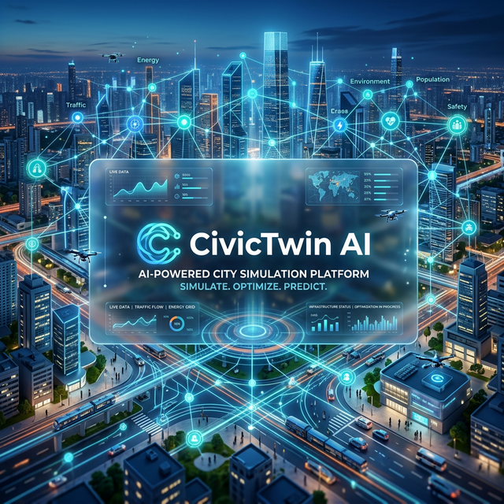

# 🏙️ CivicTwin AI



**CivicTwin AI** is a state-of-the-art AI-powered Digital Twin platform designed for urban planners, community leaders, and infrastructure developers. It leverages advanced Large Language Models (LLMs) to simulate the socio-economic and environmental impacts of infrastructure projects in real-time, providing deep insights into community needs and future outcomes.

---

## 🚀 Key Features

- **📍 Intelligent Location Analysis**: Get instant AI-generated insights for any geographic coordinate, including population density, economic status, climate zones, and current infrastructure health.
- **🏗️ Multi-Project Simulations**: Add multiple infrastructure projects (Hospitals, Solar Farms, Irrigation Systems, etc.) to a queue and simulate their cumulative impact on a region.
- **📊 Dynamic Impact Visualization**: View results through interactive radar charts and detailed metric deltas covering:
  - Economic Growth
  - Healthcare Access
  - Environmental Impact
  - Transport Efficiency
  - Water & Air Quality
- **✨ Premium UI/UX**: A modern, glassmorphic interface designed for clarity and engagement, featuring responsive panels and real-time updates.

---

## 🛠️ Technology Stack

### **Frontend**
- **Vite**: Ultra-fast build tool and dev server.
- **Vanilla JavaScript & HTML5**: High-performance, low-overhead client logic.
- **Modern CSS**: Custom digital-twin aesthetics with glassmorphism and vibrant gradients.
- **Charts.js**: Interactive data visualizations for simulation results.

### **Backend**
- **Node.js**: Asynchronous event-driven JavaScript runtime.
- **Express.js**: Robust web framework for the simulation API.
- **AWS SDK (Bedrock)**: Direct integration with Amazon's latest AI models.

### **AI Models**
- **Amazon Nova Pro**: Used for complex reasoning, scenario generation, and high-fidelity regional analysis.
- **Amazon Nova Lite**: High-speed processing for real-time simulations and place searching.
- **Rule-Based Fallback**: Built-in logic to ensure the platform remains functional even if AI services are unavailable.

---

## 📦 Dependencies

The project relies on the following key libraries to function:

### **Core Backend**
- **`express`**: Fast, unopinionated, minimalist web framework for the API.
- **`cors`**: Middleware to enable Cross-Origin Resource Sharing.
- **`dotenv`**: For loading environment variables from `.env`.
- **`axios`**: Promise-based HTTP client for external data fetching.

### **AI & Simulation**
- **`@aws-sdk/client-bedrock-runtime`**: Official AWS SDK for interacting with Amazon Bedrock (Nova models).

### **Development Tools**
- **`vite`**: Next-generation frontend tooling for high-speed development.
- **`concurrently`**: Allows running the API and UI dev servers simultaneously.
- **`kill-port`**: Utility to ensure required ports are cleared before starting the dev server.

---

## 📥 Getting Started

### Prerequisites
- [Node.js](https://nodejs.org/) (v18.x or higher)
- [npm](https://www.npmjs.com/)
- AWS Account with Bedrock access (specifically `amazon.nova-lite-v1:0` and `amazon.nova-pro-v1:0`)

### Installation

1.  **Clone the repository**:
    ```bash
    git clone https://github.com/your-username/civictwin-ai.git
    cd civictwin-ai
    ```

2.  **Install dependencies**:
    ```bash
    npm install
    ```

3.  **Configure Environment Variables**:
    Create a `.env` file in the root directory and add your credentials:
    ```env
    AWS_ACCESS_KEY_ID=your_access_key
    AWS_SECRET_ACCESS_KEY=your_secret_key
    ```

### Running the Application

Launch both the API server and the Vite frontend simultaneously:

```bash
npm run dev
```

- **UI**: [http://localhost:5173](http://localhost:5173)
- **API**: [http://localhost:3001/api](http://localhost:3001/api)

---

## 📂 Project Structure

```text
CivicTwin AI/
├── src/
│   ├── public/             # Frontend assets (HTML, CSS, JS)
│   │   ├── css/            # Stylesheets
│   │   ├── js/             # Client-side logic (app.js, results.js)
│   │   └── index.html      # Main entry point
│   ├── routes/             # Express API routes
│   ├── services/           # AI & Simulation logic
│   │   ├── novaService.js  # Amazon Nova AI integration
│   │   └── simulationEngine.js # Logic for metric calculations
│   └── server.js           # API server entry point
├── package.json            # Scripts & dependencies
└── vite.config.js          # Vite configuration
```

---

## 🛡️ Security Note
Ensure that your AWS credentials are never committed to version control. The current `novaService.js` uses environment variables as the preferred method for authentication.

---

## 🤝 Contributing
Contributions are welcome! Please feel free to submit a Pull Request or open an issue for feature requests.

## 📝 License
This project is licensed under the MIT License.

---
*Built with ❤️ by the CivicTwin AI Team.*
